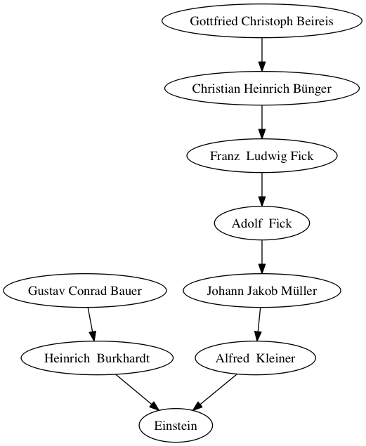

# Visualization of MathGenes
Visualize the ancestor of people described in https://www.genealogy.math.ndsu.nodak.edu using graph.

## Usage
Import the class
```
from MathGenealogy import MathGenealogy
```
Create instance
```
MG = MathGenealogy()
```
Put the person you are looking for. The PersonID can be retrieved in https://www.genealogy.math.ndsu.nodak.edu. For the next feature, I will making this more convenient.
```
PersonID = "53269"
PersonName = "Einstein"
```
Get the ancestors
```
MG.find_ancestors(PersonID,PersonName)
```
## Result
Code above will result the following graph


## Features to be added
* Search PersonID
* Find descendants

## License
GNU Affero General Public License v3.0
